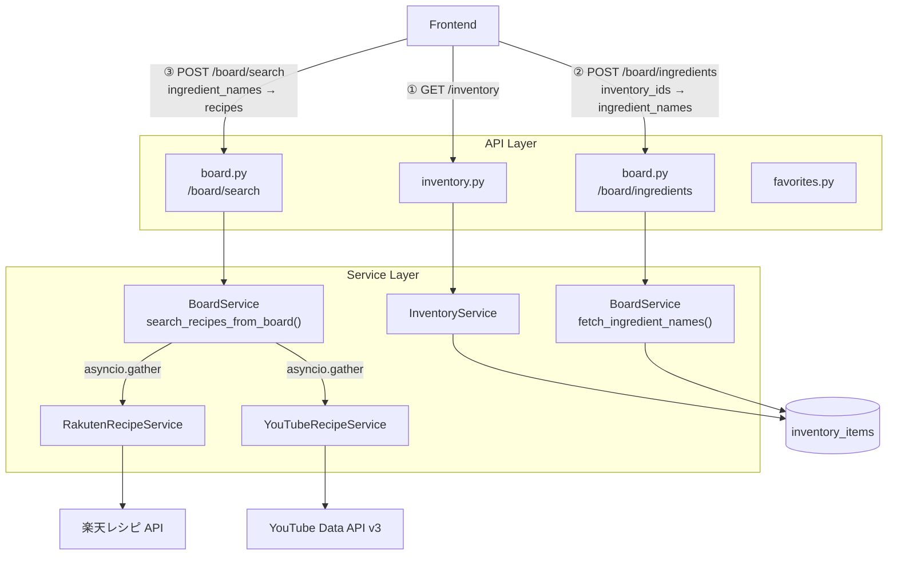

# cooking-web-backend

FastAPI で構築した cooking-web 向けバックエンド

---

## 目次
- [技術スタック](#技術スタック)
- [機能](#機能)
- [ディレクトリ構造とその役割](#ディレクトリ構造とその役割)
- [環境構築](#環境構築)
- [主なエンドポイント](#主なエンドポイント)
- [アーキテクチャ](#アーキテクチャ)

---

## 技術スタック

| カテゴリ | ライブラリ |
|---|---|
| Web フレームワーク | FastAPI |
| ASGI サーバー | Uvicorn |
| ORM | SQLAlchemy 2.0 (async) |
| DB | SQLite + aiosqlite |
| HTTP クライアント | httpx (async) |
| データ処理 | pandas |
| バリデーション | Pydantic v2 |
| パッケージ管理 | uv |
| Linter | Ruff |

---

## 機能
- レシピ検索（楽天レシピ API / YouTube Data API v3）
- 在庫管理 API
- まな板機能（選んだ在庫の食材でレシピを並列検索）
- お気に入りレシピ API
- OpenAPI 自動生成（`/docs`, `/openapi.json`）


## ディレクトリ構造とその役割
```
cooking-web-backend
├── app
│   ├── api      # HTTPエンドポイント層でAPIの定義（controller層に当たる）
│   ├── core     # 共通設定・基盤（.envの読み込みを管理）
│   ├── db       # DB接続と初期化
│   ├── models   # DBテーブルの定義（model層に当たる）
│   ├── schemas  # リクエスト・レスポンスの型の定義
│   └── services # 外部APIや業務ロジックの定義
└── test
    ├── api      # app/apiのテストケース
    ├── core     # app/coreのテストケース
    ├── db       # app/dbのテストケース
    ├── schemas  # app/schemasのテストケース
    └── services # app/servicesのテストケース
```


## 環境構築
1. Python 3.11+ を用意
2. 依存関係をインストール
   - `uv sync`
3. 環境変数を作成
   - `.env` ファイルをプロジェクトルートに作成して編集

```env
RAKUTEN_APP_ID=your_rakuten_app_id
RAKUTEN_AFFILIATE_ID=your_rakuten_affiliate_id
YOUTUBE_API_KEY=your_youtube_api_key

# 任意（デフォルト値あり）
DATABASE_URL=sqlite+aiosqlite:///./app.db
ALLOWED_ORIGINS=http://localhost:5173,http://127.0.0.1:5173
APP_ENV=dev
```

| 変数名 | 説明 | 取得先 |
|---|---|---|
| `RAKUTEN_APP_ID` | 楽天レシピ API アプリ ID | [楽天 Developers](https://webservice.rakuten.co.jp/) |
| `RAKUTEN_AFFILIATE_ID` | 楽天アフィリエイト ID | 楽天 Developers |
| `YOUTUBE_API_KEY` | YouTube Data API v3 キー | [Google Cloud Console](https://console.cloud.google.com/) |

4. 起動
   - `uv run uvicorn app.main:app --reload --port 8000`

起動後は `http://localhost:8000/docs` で Swagger UI を確認できます。


## 主なエンドポイント

| Method | Path | 概要 |
|---|---|---|
| `GET` | `/api/v1/health` | ヘルスチェック |
| `GET` | `/api/v1/inventory` | 在庫一覧を取得する |
| `POST` | `/api/v1/inventory` | 在庫を作成する |
| `DELETE` | `/api/v1/inventory/{id}` | 在庫を削除する |
| `POST` | `/api/v1/board/ingredients` | inventory_ids から食材名一覧を取得する |
| `POST` | `/api/v1/board/search` | 食材名配列でレシピを並列検索する |
| `GET` | `/api/v1/recipes/favorites` | お気に入りレシピを取得する |
| `POST` | `/api/v1/recipes/favorites` | お気に入りレシピを作成する |


## アーキテクチャ


